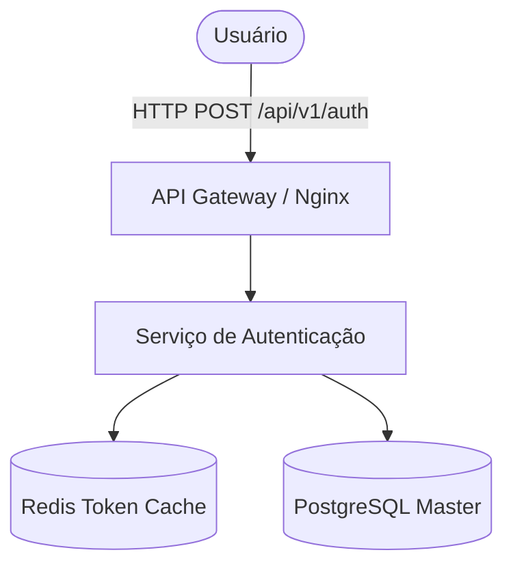
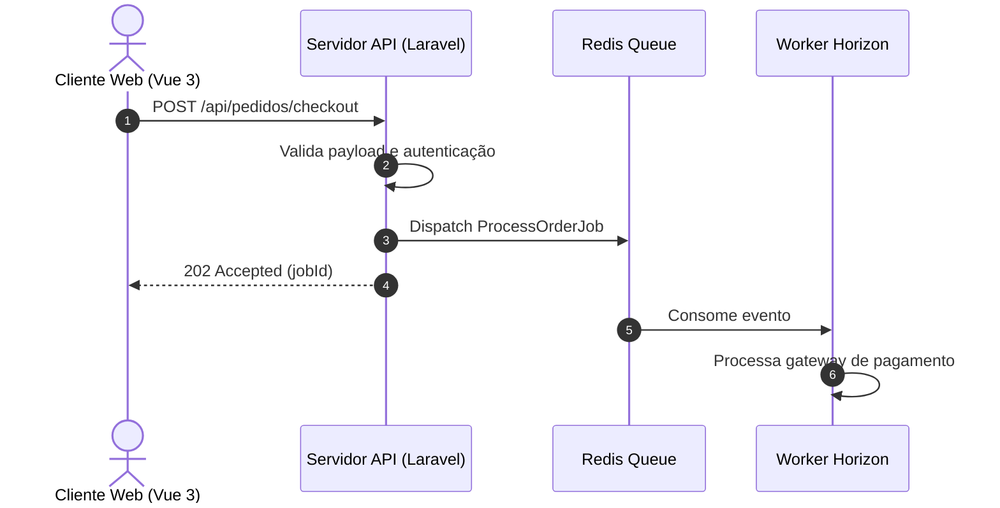
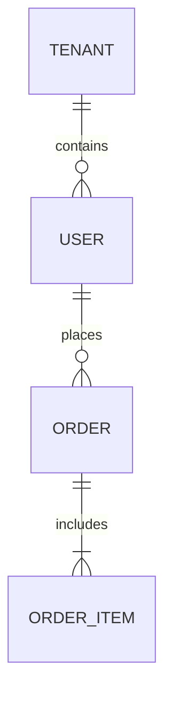

# Mermaid Diagramming Guidelines

## When to Use
- Visualizing application architectures, distributed service interactions, or module boundaries.
- Documenting request/response sequences between frontend, backend, queues, and third-party APIs.
- Creating clean flowchart state diagrams directly in markdown artifacts.

## Syntax Patterns

### 1. Flowchart / Arquitetura

### 2. Diagrama de Sequência (Sequence Diagram)

### 3. Diagrama de Entidade-Relacionamento (ERD)

## Boas Práticas
- Use aspas duplas em rótulos com caracteres especiais ou parênteses: `id["Texto (Info)"]`.
- Evite quebras manuais com ` ` em nós complexos; prefira nós estruturados e subgraphs.
