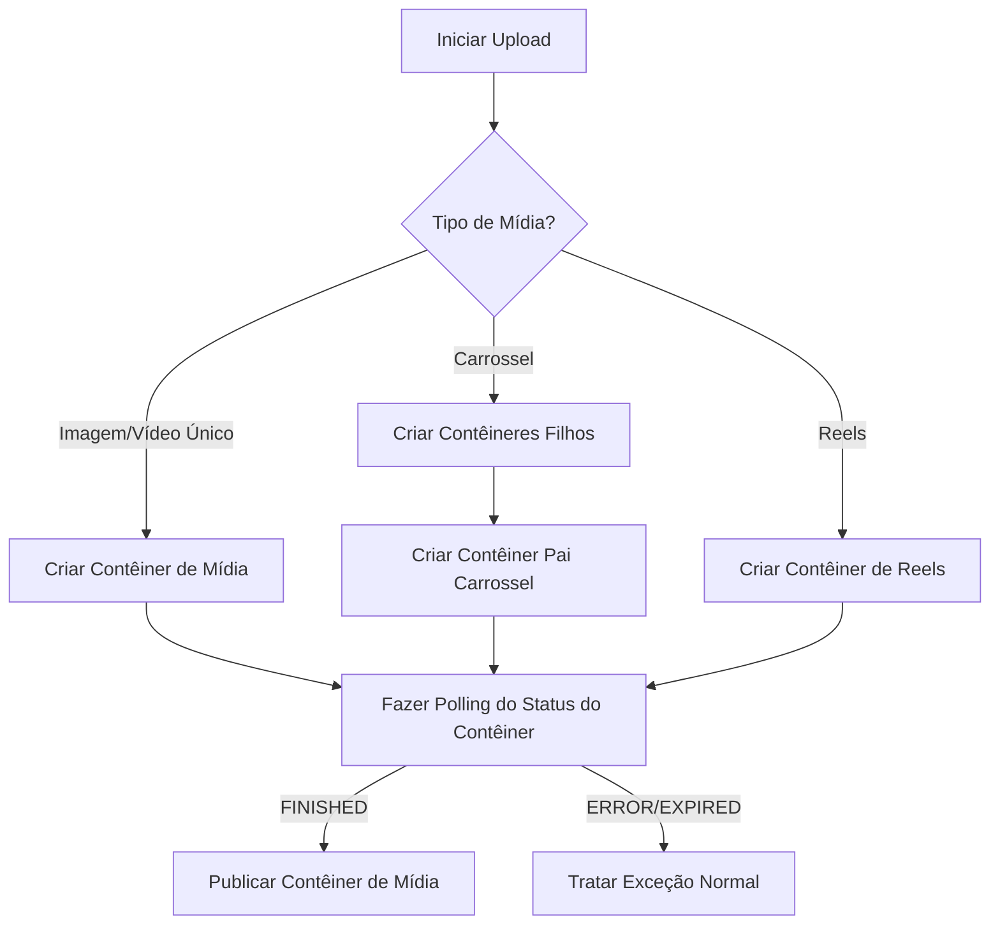

# Melhores Práticas de Integração com a Meta Graph API no AdonisJS

## Objetivo
Estabelecer padrões estruturados e seguros para a integração de publicação e monitoramento de mídias usando a API do Meta Graph (Facebook Pages e Instagram Business) em aplicações AdonisJS v6. Isso inclui gerenciamento seguro do ciclo de vida de tokens, fluxos de publicação resilientes, polling assíncrono do status de contêineres e normalização de erros.

---

## Instruções

### 1. Gerenciamento Seguro do Ciclo de Vida de Tokens
A Meta Graph API utiliza diferentes tokens de acesso com tempos de expiração variados. Para permitir publicações persistentes em nome dos clientes, você deve trocar tokens de usuário de curta duração por tokens de página de longa duração que não expiram.

> **Veja também:** a renovação periódica dos tokens de longa duração (job/cron de refresh antes dos 60 dias, persistência e detecção de tokens revogados) é responsabilidade de `adonisjs-instagram-meta-token-renewal-best-practices`. Esta seção cobre apenas a troca inicial de tokens no fluxo de publicação.

- **Token de Usuário de Curta Duração**: Obtido no login do frontend (válido por 1 a 2 horas).
- **Token de Usuário de Longa Duração**: Trocado a partir do token de curta duração (válido por 60 dias).
- **Token de Acesso de Página de Longa Duração**: Solicitado usando o token de usuário de longa duração. Ele é permanente, a menos que seja revogado ou o usuário altere sua senha.

#### Implementação do Serviço de Troca de Tokens
```typescript
import { inject } from '@adonisjs/core'
import encryption from '@adonisjs/core/services/encryption'
import env from '#start/env'

@inject()
export class MetaTokenService {
  private readonly baseUrl = 'https://graph.facebook.com/v24.0'
  private readonly appId = env.get('META_APP_ID')
  private readonly appSecret = env.get('META_APP_SECRET')

  /**
   * Troca um token de usuário de curta duração por um de longa duração (válido por 60 dias).
   */
  async getLongLivedUserToken(shortLivedToken: string): Promise<string> {
    const url = `${this.baseUrl}/oauth/access_token`
    const params = new URLSearchParams({
      grant_type: 'fb_exchange_token',
      client_id: this.appId,
      client_secret: this.appSecret,
      fb_exchange_token: shortLivedToken,
    })

    const response = await fetch(`${url}?${params.toString()}`)
    const data = await response.json()

    if (!response.ok || data.error) {
      throw new Error(`Falha ao obter token de longa duração: ${data.error?.message || 'Erro desconhecido'}`)
    }

    return data.access_token
  }

  /**
   * Obtém os tokens de página de longa duração (permanentes) e IDs de conta associados.
   */
  async getPageAccessTokens(longLivedUserToken: string, userId: string) {
    const url = `${this.baseUrl}/${userId}/accounts`
    const params = new URLSearchParams({
      access_token: longLivedUserToken,
    })

    const response = await fetch(`${url}?${params.toString()}`)
    const data = await response.json()

    if (!response.ok || data.error) {
      throw new Error(`Falha ao carregar páginas vinculadas: ${data.error?.message || 'Erro desconhecido'}`)
    }

    // Retorna lista contendo o id da página, nome e o token de acesso de longa duração da página
    return data.data.map((page: any) => ({
      pageId: page.id,
      name: page.name,
      accessToken: page.access_token, // Este token é permanente
    }))
  }
}
```

> [!IMPORTANT]
> Os tokens de acesso devem ser sempre criptografados antes de serem salvos no banco. Use `encryption.encrypt(token)` do AdonisJS para criptografá-los e descriptografe-os ao recuperá-los. Nunca armazene tokens em texto aberto.

---

### 2. Fluxo de Publicação no Instagram (Processo em 3 Etapas)
A publicação de mídias em Contas Comerciais do Instagram via Graph API requer um fluxo assíncrono de três etapas para evitar timeouts e bloqueios de rede.



#### Etapa 2.1: Chamadas da API para Criação de Contêineres
Utilize os seguintes endpoints sob `https://graph.facebook.com/v24.0/{instagram-business-account-id}/media`:

- **Contêiner de Imagem Única**:
  - Endpoint: `POST /media`
  - Payload: `{ image_url: string, caption: string }`
- **Contêiner de Reels**:
  - Endpoint: `POST /media`
  - Payload: `{ media_type: 'REELS', video_url: string, caption: string }`
- **Itens de Carrossel (Filhos)**:
  - Endpoint: `POST /media` (Deve ser executado para cada slide do carrossel)
  - Payload: `{ image_url: string, is_carousel_item: true }`
- **Contêiner Pai do Carrossel**:
  - Endpoint: `POST /media`
  - Payload: `{ media_type: 'CAROUSEL', children: 'child_id_1,child_id_2', caption: string }`

---

### 3. Polling Assíncrono com Backoff Exponencial
A Meta processa mídias de vídeo (especialmente Reels e slides de carrossel) de forma assíncrona. Tentar publicar um contêiner antes que o seu status seja `FINISHED` resultará em erro da API.

#### Implementação da Rotina de Polling no Serviço
```typescript
import logger from '@adonisjs/core/services/logger'

export class MetaPublishingService {
  private readonly maxAttempts = 8
  private readonly baseDelayMs = 4000 // Atraso base inicial de 4 segundos

  /**
   * Aguarda o processamento de mídias pesadas (vídeos/carrosséis) pela Meta Graph API.
   */
  async awaitContainerProcessing(containerId: string, accessToken: string): Promise<void> {
    for (let attempt = 1; attempt <= this.maxAttempts; attempt++) {
      const url = `https://graph.facebook.com/v24.0/${containerId}`
      const params = new URLSearchParams({
        fields: 'status_code,status',
        access_token: accessToken,
      })

      const response = await fetch(`${url}?${params.toString()}`)
      const body = await response.json()

      if (!response.ok) {
        throw new Error(`Erro na API do Meta durante o polling: ${body.error?.message || 'Erro desconhecido'}`)
      }

      const statusCode = body.status_code

      if (statusCode === 'FINISHED') {
        logger.info({ containerId }, 'Contêiner de mídia processado com sucesso.')
        return
      }

      if (statusCode === 'ERROR') {
        throw new Error(`Processamento do contêiner falhou na Meta: ${body.status || 'Erro desconhecido'}`)
      }

      // Cálculo de backoff exponencial: 4s, 8s, 16s, 32s...
      const delay = this.baseDelayMs * Math.pow(2, attempt - 1)
      logger.debug({ containerId, attempt, nextDelay: delay }, 'Mídia processando. Aguardando próximo polling...')
      await new Promise((resolve) => setTimeout(resolve, delay))
    }

    throw new Error('Tempo limite esgotado esperando o processamento da mídia pela Meta Graph API.')
  }
}
```

> [!TIP]
> Nunca bloqueie os ciclos de requisição/resposta HTTP (threads de controllers). Sempre execute a criação de contêineres, o polling e a publicação final dentro de uma fila em background (por exemplo, um worker do BullMQ).

---

### 4. Mapeamento e Normalização de Erros da API
A Meta Graph API retorna respostas de erro estruturadas em JSON. Integre um normalizador que intercepte códigos de status e os mapeie para exceções personalizadas da aplicação.

#### Formato Esperado de Resposta de Erro
```json
{
  "error": {
    "message": "Error validating access token: Session has expired...",
    "type": "OAuthException",
    "code": 190,
    "error_subcode": 463,
    "fbtrace_id": "A1B2C3D4E5"
  }
}
```

#### Exceções Personalizadas no AdonisJS e Normalizador
```typescript
import { Exception } from '@adonisjs/core/exceptions'

// Exceção base de integração da Meta
export class MetaApiException extends Exception {
  static status = 502
  static code = 'E_META_API_ERROR'
}

// Exceção para tokens expirados ou revogados (Code 190)
export class MetaTokenExpiredException extends Exception {
  static status = 401
  static code = 'E_META_TOKEN_EXPIRED'
}

// Exceção para limitação de taxa (Code 4 / 17)
export class MetaRateLimitException extends Exception {
  static status = 429
  static code = 'E_META_RATE_LIMIT'
}

export class MetaErrorNormalizer {
  /**
   * Normaliza respostas de erro da Graph API para exceções internas do aplicativo.
   */
  static normalize(errorPayload: any): never {
    const error = errorPayload?.error
    if (!error) {
      throw new MetaApiException('Resposta de erro desconhecida da API da Meta.')
    }

    const code = Number(error.code)
    const subcode = Number(error.error_subcode)
    const message = error.message || 'Erro sem mensagem informada.'

    // Token expirado, inválido ou revogado
    if (code === 190) {
      throw new MetaTokenExpiredException(
        `Token da Meta expirou ou foi revogado. Código ${code}, Sub-código ${subcode}: ${message}`
      )
    }

    // Erros de Rate Limit (Frequência de requisições excedida)
    if (code === 4 || code === 17 || code === 341) {
      throw new MetaRateLimitException(`Limite de requisições atingido na Meta API: ${message}`)
    }

    // Ação bloqueada por spam ou segurança
    if (code === 368) {
      throw new MetaApiException(`Ação bloqueada temporariamente pela política de segurança da Meta: ${message}`)
    }

    // Qualquer outro erro não mapeado cai no erro geral
    throw new MetaApiException(`Erro na Meta API (Code: ${code}, Sub-code: ${subcode}): ${message}`)
  }
}
```

---

## Restrições
- **Idioma:** Sempre se comunique com o usuário humano em Português (pt-BR). Este é o idioma padrão de conversação Agente↔Humano, sempre, sem exceção — independentemente do idioma em que o conteúdo/corpo desta skill está escrito.
- **Sem Polling Síncrono**: Nunca execute loops de polling em controllers ou threads HTTP síncronas. Sempre utilize filas e background workers (como o BullMQ).
- **Criptografar Tokens**: Nunca salve tokens de acesso de Usuário ou Página em colunas do banco de dados em texto aberto. Utilize o serviço `Encryption` do AdonisJS.
- **Limitar Tentativas de Polling**: Sempre configure limites máximos estritos para tentativas de polling (`maxAttempts`) e tempo máximo de espera para evitar que os workers fiquem travados indefinidamente.
- **Verificar Status de Finalização**: Nunca chame `publishContainer` sem antes garantir que a verificação de polling retornou `status_code === 'FINISHED'`.
- **Proteção em Logs**: Nunca escreva tokens brutos, chaves secretas do app ou credenciais do cliente em arquivos de log públicos. Utilize filtros ou mascaramento de dados.
