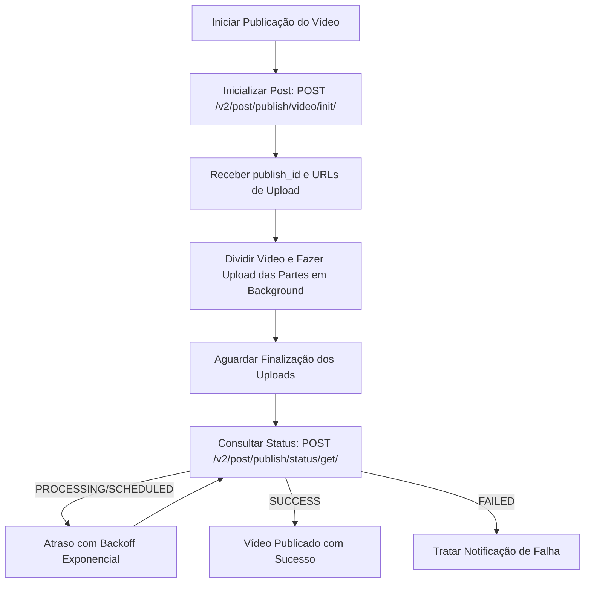

# Melhores Práticas de Integração com a API do TikTok no AdonisJS

## Objetivo
Estabelecer padrões para a integração com a API do TikTok em aplicações AdonisJS v6. Isso inclui a implementação segura do fluxo TikTok OAuth v2, gerenciamento de persistência e renovação automática de tokens criptografados, orquestração resiliente do upload de vídeos em blocos (Direct Post API) via filas em segundo plano com BullMQ, verificação do status de publicação com backoff exponencial e processamento seguro de webhooks.

---

## Instruções

### 1. Gerenciamento de Autenticação e Ciclo de Vida do Token TikTok OAuth v2
Os tokens do TikTok OAuth v2 possuem validades distintas: os tokens de acesso (Access Tokens) expiram em 24 horas, enquanto os tokens de atualização (Refresh Tokens) expiram em 365 dias. É necessário implementar um mecanismo confiável para renovação do token de acesso e salvar todos os tokens de forma criptografada no banco de dados.

#### Implementação do Serviço de Gerenciamento de Tokens
```typescript
import { inject } from '@adonisjs/core'
import encryption from '@adonisjs/core/services/encryption'
import env from '#start/env'

@inject()
export class TikTokTokenService {
  private readonly baseUrl = 'https://open.tiktokapis.com/v2'
  private readonly clientKey = env.get('TIKTOK_CLIENT_KEY')
  private readonly clientSecret = env.get('TIKTOK_CLIENT_SECRET')

  /**
   * Renova o token de acesso expirado utilizando um refresh token válido.
   */
  async refreshAccessToken(encryptedRefreshToken: string): Promise<{
    accessToken: string
    refreshToken: string
    expiresIn: number
    refreshExpiresIn: number
  }> {
    const refreshToken = encryption.decrypt(encryptedRefreshToken, 'tiktok-token')
    if (typeof refreshToken !== 'string') {
      throw new Error('Refresh token inválido ou ilegível.')
    }

    const url = `${this.baseUrl}/oauth/token/`
    const payload = new URLSearchParams({
      client_key: this.clientKey,
      client_secret: this.clientSecret,
      grant_type: 'refresh_token',
      refresh_token: refreshToken,
    })

    const response = await fetch(url, {
      method: 'POST',
      headers: {
        'Content-Type': 'application/x-www-form-urlencoded',
      },
      body: payload.toString(),
    })

    const data = await response.json()

    if (!response.ok || data.error) {
      throw new Error(`Falha ao renovar token do TikTok: ${data.error_description || data.error || 'Erro desconhecido'}`)
    }

    return {
      accessToken: encryption.encrypt(data.access_token, undefined, 'tiktok-token'),
      refreshToken: encryption.encrypt(data.refresh_token, undefined, 'tiktok-token'),
      expiresIn: data.expires_in,
      refreshExpiresIn: data.refresh_expires_in,
    }
  }
}
```

> [!IMPORTANT]
> Nunca armazene os tokens de acesso ou atualização do TikTok em texto puro no banco de dados. Utilize o serviço `encryption.encrypt()` do AdonisJS para criptografar os dados antes de salvar e decodifique-os somente ao realizar as chamadas de API.

---

### 2. Fluxo de Publicação de Vídeos (Direct Post API do TikTok)
O TikTok exige um fluxo assíncrono para a publicação de vídeos. O processo do Direct Post envolve:
1. **Inicialização (`/v2/post/publish/video/init/`)**: Declaração dos detalhes do vídeo (tamanho do arquivo, quantidade total de blocos/chunks) e obtenção do `publish_id` e das URLs para upload dos blocos.
2. **Upload em Blocos (Chunked Upload)**: Divisão e upload das partes do vídeo para as URLs retornadas usando requisições HTTP `PUT`.
3. **Verificação de Status (`/v2/post/publish/status/get/`)**: Monitoramento do processamento do vídeo pelo TikTok.



#### Implementação do Serviço de Publicação
```typescript
import { inject } from '@adonisjs/core'
import logger from '@adonisjs/core/services/logger'
import fs from 'node:fs/promises'

@inject()
export class TikTokPublishingService {
  private readonly baseUrl = 'https://open.tiktokapis.com/v2'

  /**
   * Inicializa a sessão de publicação de vídeo.
   */
  async initializePublish(accessToken: string, fileSizeBytes: number, title: string) {
    const url = `${this.baseUrl}/post/publish/video/init/`
    
    const response = await fetch(url, {
      method: 'POST',
      headers: {
        'Authorization': `Bearer ${accessToken}`,
        'Content-Type': 'application/json',
      },
      body: JSON.stringify({
        post_info: {
          title: title,
          privacy_level: 'PUBLIC_TO_EVERYONE',
          disable_duet: false,
          disable_stitch: false,
          disable_comment: false,
          video_cover_timestamp_ms: 1000
        },
        source_info: {
          source: 'FILE_UPLOAD',
          video_size: fileSizeBytes,
          chunk_size: 10 * 1024 * 1024, // Ex: blocos de 10MB
          total_chunk_count: Math.ceil(fileSizeBytes / (10 * 1024 * 1024))
        }
      })
    })

    const body = await response.json()
    if (!response.ok || body.error) {
      throw new Error(`Falha ao inicializar upload no TikTok: ${body.error?.message || 'Erro desconhecido'}`)
    }

    return body.data // Contém o publish_id e as urls para upload (upload_url)
  }

  /**
   * Envia um bloco do vídeo para a URL temporária do S3 fornecida pelo TikTok.
   */
  async uploadChunk(uploadUrl: string, chunkPath: string, startByte: number, endByte: number, totalSize: number) {
    // O fetch nativo (undici) não aceita um ReadStream do Node diretamente.
    // Como os blocos são limitados (ex.: 10MB), lemos o bloco como Buffer/Uint8Array,
    // que o fetch aceita nativamente como corpo da requisição.
    const chunk = await fs.readFile(chunkPath)

    const response = await fetch(uploadUrl, {
      method: 'PUT',
      headers: {
        'Content-Range': `bytes ${startByte}-${endByte}/${totalSize}`,
        'Content-Type': 'video/mp4',
        'Content-Length': String(chunk.byteLength),
      },
      body: chunk,
    })

    if (!response.ok) {
      throw new Error(`Falha ao enviar bloco para o TikTok. Status HTTP: ${response.status}`)
    }
  }
}
```

> [!TIP]
> Nunca execute o fluxo de upload e divisão de blocos de forma síncrona dentro da requisição HTTP principal. Utilize filas em segundo plano gerenciadas pelo BullMQ para processar o upload dos chunks.

---

### 3. Monitoramento Assíncrono com Backoff Exponencial
Após finalizar o envio de todos os blocos, o vídeo entra em uma fila de processamento no TikTok. O status deve ser consultado periodicamente.

```typescript
export class TikTokPollingService {
  private readonly maxAttempts = 10
  private readonly baseDelayMs = 5000 // 5 segundos de atraso inicial

  async pollPublishStatus(accessToken: string, publishId: string): Promise<void> {
    const url = 'https://open.tiktokapis.com/v2/post/publish/status/get/'

    for (let attempt = 1; attempt <= this.maxAttempts; attempt++) {
      const response = await fetch(url, {
        method: 'POST',
        headers: {
          'Authorization': `Bearer ${accessToken}`,
          'Content-Type': 'application/json',
        },
        body: JSON.stringify({ publish_id: publishId }),
      })

      const body = await response.json()
      if (!response.ok || body.error) {
        throw new Error(`Consulta de status no TikTok falhou: ${body.error?.message || 'Erro desconhecido'}`)
      }

      const status = body.data.status
      if (status === 'SUCCESS') {
        return
      }

      if (status === 'FAILED') {
        throw new Error(`Processamento do vídeo falhou no TikTok: ${body.data.fail_reason || 'Motivo desconhecido'}`)
      }

      // Para status como 'PROCESSING' ou 'SCHEDULED', aguarda antes de tentar novamente
      const delay = this.baseDelayMs * Math.pow(2, attempt - 1)
      await new Promise((resolve) => setTimeout(resolve, delay))
    }

    throw new Error('Tempo limite esgotado ao aguardar o processamento do vídeo no TikTok.')
  }
}
```

---

### 4. Normalização de Erros e Limite de Requisições (Rate Limits)
O TikTok retorna códigos de erro padronizados. Crie exceções customizadas no AdonisJS para tratar esses cenários.

```typescript
import { Exception } from '@adonisjs/core/exceptions'

export class TikTokApiException extends Exception {
  static status = 502
  static code = 'E_TIKTOK_API_ERROR'
}

export class TikTokRateLimitException extends Exception {
  static status = 429
  static code = 'E_TIKTOK_RATE_LIMIT'
}

export class TikTokErrorNormalizer {
  static normalize(errorPayload: any): never {
    const error = errorPayload?.error
    if (!error) {
      throw new TikTokApiException('Erro desconhecido retornado pela API do TikTok.')
    }

    const code = error.code
    const message = error.message || 'Mensagem de erro não informada.'

    if (code === 'rate_limit_exceeded' || code === 429) {
      throw new TikTokRateLimitException(`Limite de requisições excedido no TikTok: ${message}`)
    }

    throw new TikTokApiException(`Erro na API do TikTok [${code}]: ${message}`)
  }
}
```

---

### 5. Verificação e Processamento de Webhooks
O TikTok envia notificações de eventos (como alterações de permissão ou finalização de uploads). Valide a assinatura de segurança em todas as requisições recebidas.

```typescript
import { HttpContext } from '@adonisjs/core/http'
import crypto from 'node:crypto'
import env from '#start/env'

export default class TikTokWebhooksController {
  async handle({ request, response }: HttpContext) {
    const signature = request.header('TikTok-Signature')
    const timestamp = request.header('TikTok-Timestamp')
    const clientSecret = env.get('TIKTOK_CLIENT_SECRET')

    // O TikTok assina a concatenação do timestamp com o corpo BRUTO da requisição
    // (não o JSON re-serializado). Registre o body cru via um middleware/bodyparser
    // raw para que o HMAC seja idêntico ao calculado pelo TikTok.
    const rawBody = request.raw() ?? ''
    if (!signature || !timestamp) {
      return response.status(401).send('Cabeçalhos de assinatura ausentes')
    }

    // Validação da assinatura do webhook do TikTok: HMAC-SHA256 de `${timestamp}.${rawBody}`
    const expectedSignature = crypto
      .createHmac('sha256', clientSecret)
      .update(`${timestamp}.${rawBody}`)
      .digest('hex')

    // Comparação em tempo constante para evitar timing attacks.
    const valid =
      signature.length === expectedSignature.length &&
      crypto.timingSafeEqual(Buffer.from(signature), Buffer.from(expectedSignature))

    if (!valid) {
      return response.status(401).send('Assinatura inválida')
    }

    const event = request.input('event')
    // Processar o evento de forma assíncrona
    
    return response.status(200).send({ status: 'ok' })
  }
}
```

---

## Restrições
- **Idioma:** Sempre se comunique com o usuário humano em Português (pt-BR). Este é o idioma padrão de conversação Agente↔Humano, sempre, sem exceção — independentemente do idioma em que o conteúdo/corpo desta skill está escrito.
- **Proibido Upload Síncrono de Blocos**: A divisão de arquivos e requisições PUT individuais nunca devem ser executadas síncronas no ciclo HTTP. Use workers do BullMQ.
- **Criptografia Obrigatória de Credenciais**: Sempre salve access tokens, refresh tokens e credenciais de usuários em colunas criptografadas com o serviço `Encryption` do AdonisJS.
- **Limites de Polling Estritos**: Sempre imponha um número máximo de tentativas de polling e use backoff exponencial para evitar a ocupação indefinida dos workers de fila.
- **Mascarar Logs Sensíveis**: Nunca escreva segredos de cliente, chaves públicas, tokens em texto puro ou credenciais confidenciais nos logs do sistema.
- **Validação de Webhooks**: Sempre valide o cabeçalho `TikTok-Signature` calculando o HMAC-SHA256 de `${TikTok-Timestamp}.${corpo bruto}` com o segredo do cliente (comparação em tempo constante) para rejeitar payloads falsificados.
